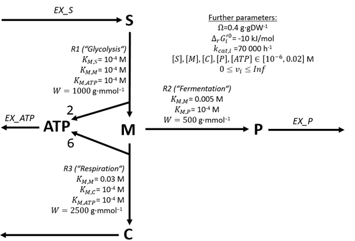

# Linear Programs

??? abstract "Quickstart code"
    ```py
    #%
    # Print stoichiometric matrix
    from cobrak.example_models import toy_model
    from cobrak.utilities import get_stoichiometric_matrix

    print(get_stoichiometric_matrix(toy_model))

    #%
    # Perform Flux Balance Analysis with simple objective
    # Load the general Linear Program optimization function of COBRA-k
    # which can be found in COBRA-k's submodule 'lps'
    from cobrak.lps import perform_lp_optimization
    # Load some pretty-print functions (can be found in submodule 'printing')
    from cobrak.printing import print_dict, print_optimization_result

    # Maximize the flux of Glycolysis using the CBM constraints
    fba_result = perform_lp_optimization(
        toy_model,
        "Glycolysis",
        +1,
    ) # fba_result is a dict[str, float]

    # Pretty print result as dictionary
    print_dict(fba_result)

    # Pretty print the result as (nicer-looking :-) tables
    print_optimization_result(toy_model, fba_result)

    #%
    # Load the name of the variable that holds the objective name
    from cobrak.constants import OBJECTIVE_VAR_NAME

    print(fba_result[OBJECTIVE_VAR_NAME])

    #%
    # Perform FBA with more complex objective
    perform_lp_optimization(
        toy_model,
        {"Glycolysis": -1.5, "Overflow": 2.0}, # No str anymore
        +1,
    )

    #%
    # Perform pFBA
    from cobrak.constants import FLUX_SUM_VAR_ID
    # We perform a pFBA on our Glycolysis optimization example
    # 1) We set the objective value as minimum
    toy_model.reactions["Glycolysis"].min_flux = fba_result["Glycolysis"]

    # 2) Now, the flux sum minimization
    pfba_result = perform_lp_optimization(
        toy_model,
        FLUX_SUM_VAR_ID,
        -1,
        with_flux_sum_var=True,
    ) # Again, pfba_result is a dict[str, float]

    # Let's print our pFBA result
    print_optimization_result(toy_model, pfba_result)

    # Reset model for the next calculations
    toy_model.reactions["Glycolysis"].min_flux = 0.0

    #%
    # Perform Flux Variability Analysis
    from cobrak.lps import perform_lp_variability_analysis
    from cobrak.printing import print_variability_result
    # Perform general FVA (we did not set the previous objective value as minimum)
    var_result = perform_lp_variability_analysis(
        toy_model,
    )

    # Pretty print result as tables
    print_variability_result(toy_model, var_result)

    # Print a minimal value
    print(var_result["Overflow"][0])

    #%
    # Perform enzyme-constrained ecFBA
    ecfba_result = perform_lp_optimization(
        toy_model,
        {"Glycolysis": +1.0},  # No str anymore
        +1,
        with_enzyme_constraints=True,  # Activate linear enzyme constraints
    )

    # Pretty-print result, now also with actual enzyme usage :-)
    print_optimization_result(toy_model, ecfba_result)

    #%
    # Perform general enzyme-constrained ecFVA
    var_result = perform_lp_variability_analysis(
        toy_model
    )

    # Pretty print result as tables - again, now with enzyme usages :-)
    print_variability_result(toy_model, var_result)

    #%
    from cobrak.utilities import get_reaction_enzyme_var_id
    # Get an enzyme variable name
    enzyme_name_of_glycolysis = get_reaction_enzyme_var_id("Glycolysis", toy_model.reactions["Glycolysis"])
    print(enzyme_name_of_glycolysis)

    #%
    # Create XLSX spreadsheet with variability and optimization results
    from cobrak.spreadsheet_functionality import (
        OptimizationDataset, # Here, we set the optimization result and its wished shown data
        VariabilityDataset, # Here, we set the variability result and its wished shown data
        create_cobrak_spreadsheet, # The function to generate the XLSX
    )

    # We're going to create an XLSX with the following three results:
    # 1. General FVA
    var_result = perform_lp_variability_analysis(
        toy_model
    )
    # 2. ATP optimization
    max_atp_result = perform_lp_optimization(
        toy_model,
        "ATP_Consumption",
        +1,
    )
    # 2. Overflow optimization
    max_overflow_result = perform_lp_optimization(
        toy_model,
        "Overflow",
        +1,
    )

    # Now let's wrap the variability result into a
    # create_cobrak_spreadsheet()-compatible format 🎁
    # The keys are the dataset titles in the spreadsheet
    variability_datasets: dict[str, VariabilityDataset] = {
        "FVA result": VariabilityDataset(
            data=var_result, # Obligatory argument
            with_df=False, # Optional, default False; Do we show driving forces (see MILP chapter)?
        )
    } # This is a list as we could add multiple variability results

    # Now let's wrap the optimization results into a
    # create_cobrak_spreadsheet()-compatible format 🎁
    # The keys are the dataset titles in the spreadsheet
    optimization_datasets: dict[str, OptimizationDataset] = {
        "Max ATP": OptimizationDataset(
            data=max_atp_result, # Obligatory argument
            with_df=False, # Optional, default False; Do we show driving forces (see MILP chapter)?
            with_vplus=False, # Optional, default False; Do we show V+ (see enzyme constraints)?
            with_kappa=False, # Optional, default False; Do we show kappa values (see NLP chapter)?
            with_gamma=False, # Optional, default False; Do we show gamma values (see NLP chapter)?
            with_kinetic_differences=False, # Optional, default False; Do we show NLP approximation differences (see corrections chapter)?
            with_error_corrections=False,  # Optional, default False; Do we show corrections (see corrections chapter)?
        ),
        "Max Overflow": OptimizationDataset(
            data=max_overflow_result,
        ),
    }

    # Create XLSX spreadsheet (for this example, to not pollute your
    # file system, as temporary file)
    import tempfile
    from cobrak.io import json_write
    with tempfile.NamedTemporaryFile(suffix='.xlsx', delete=False) as temp:
        json_write(temp.name, fba_result)
        create_cobrak_spreadsheet(
            temp.name,
            toy_model,
            variability_datasets,
            optimization_datasets,
        )
    print(f"Spreadsheet created! You can now load it in your favorite spreadsheet viewer at {temp.name}")


    #%
    # Store optimization result as JSON (you can do the same for variability results)
    from cobrak.io import json_load, json_write

    # Perform FBA
    fba_result = perform_lp_optimization(
        toy_model,
        {"Glycolysis": +1.0},  # No str anymore
        +1,
    )

    # Store ecFBA result as JSON (for this example, to not pollute your
    # file system, as temporary file)
    import tempfile
    with tempfile.NamedTemporaryFile(suffix='.json') as temp:
        json_write(temp.name, fba_result)

        # Load the ecFBA result again
        loaded_fba_result = json_load(temp.name)

        # Print one flux value of the ecFBA result
        print(loaded_fba_result["Glycolysis"])

    #%
    # Export optimization result as CNApy scenario file
    from cobrak.utilities import create_cnapy_scenario_out_of_optimization_dict

    # Perform FBA
    fba_result = perform_lp_optimization(
        toy_model,
        {"Glycolysis": +1.0},  # No str anymore
        +1,
    )

    # Store ecFBA result as CNApy scenario (for this example, to not pollute your
    # file system, as temporary file)
    import tempfile
    with tempfile.NamedTemporaryFile(suffix=".scen", delete=False) as temp:
        create_cnapy_scenario_out_of_optimization_dict(
            path=temp.name,
            cobrak_model=toy_model,
            optimization_dict=fba_result,
        )

        # Print one flux value of the ecFBA result
        print("The .scen file is in:", temp.name, "and can now be loaded in CNApy")
        print("Use the CNApy default model 'cobrak_toymodel.cna' for a succesful visualization of the result")

    #%
    # Run optimization with different solver
    from cobrak.dataclasses import Solver

    ipopt = Solver(
        name="ipopt", # This must be the same name as given in pyomo
        solver_options={ # Options for the called solver itself
            "max_iter": 100_000,
            # Note that these options are solver-specific, i.e. they
            # typically won't work for other solvers
        },
        solver_attrs={
            # These would be attributes to the pyomo solver object itself
            # e.g., for the solver SCIP, we may set
            # "_version_timeout": 180 to prevent a fast timeout of pyomo's
            # SCIP call
        },
        solve_extra_options={
            # These would be extra argument's to pyomo's solve function
            # Consult pyomo's documentation on the possible arguments
        },
    )

    print("Now we solve with the solver IPOPT :D")
    perform_lp_optimization(
        toy_model,
        "ATP_Consumption",
        +1,
        solver=ipopt,
        verbose=True, # Show explicitly the IPOPT output
    )
    ```

!!! warning
    As explained in the Installation chapter, you might have to install the quite capable mixed-integer (non-)linear open-source solver [SCIP](https://scipopt.org/) on your system to run the examples of this documentation. That's because, although the COBRA-k package installs the SCIP Python package, SCIP itself might be missing on some systems.

    If SCIP is not available on your system, you may try to use the pre-installed HiGHS solver by (i) adding ```from cobrak.dataclasses import HIGHS``` as first line in all your scripts and then, in all optimization functions (such as ```perform_lp_optimization```), using the argument ```solver=HIGHS```.

    If HiGHS also does not work, try installing and using the free and open-source solver [GLPK](https://www.gnu.org/software/glpk/) by (i) adding ```from cobrak.dataclasses import Solver``` as first line in all your scripts and then, in all optimization functions (such as ```perform_lp_optimization```), using the argument ```solver=Solver(name="glpk")```.

## Introduction

COBRA-k's analyses are all based on the framework of "**C**onstraint-**B**ased **R**econstruction and **A**nalysis" [[Review]](https://doi.org/10.1038/nrg3643), enriched with **k**inetics []() - in short COBRA-k. We performed the Constraint-Based *Reconstruction* by creating our small toy model. Some constraints that we set were minimal and maximal fluxes and concentrations. And now, we perform some Constraint-Based *Analysis* :D

In this chapter, we concentrate on Constraint-Based Analyses based on Linear Programming or LP [[Paper]](https://doi.org/10.1515/9781400884179)[[Wikipedia]](https://en.wikipedia.org/wiki/Linear_programming), also called Linear Optimization.

??? info "Excursion: Linear Programming (LP)"
    While we often want to find *one* solution for a single or a system of linear equations, in LP, we want to find an *optimal* solution. E.g. instead of finding one possible value for a variable $x$, we would want to find the *maximal* or *minimal* possible value of $x$ given the linear equations/constraints.

    A general form of a maximizing Linear Program can be written as follows:

    $$
    \operatorname*{\mathbf{maximize}}_{\mathbf{x}} \ \mathbf{g}ᵀ  \\
    subject \ to \ the \ constraints \\
    \mathbf{A} ⋅ \mathbf{x} ≤ \mathbf{b} \\
    x^{min}_i < x_i < x^{max}_i
    $$

    $\mathbf{x}$ of length $n$ is our vector of variables that we may change in our LP (as indicated by being shown below the operation $maximize$). $\mathbf{g}$ also of length $n$ is our linear *objective function* that we want to maximize. For each element $x_i$ of $\mathbf{x}$, it assigns a numeric weight. The first set of constraints restricts $\mathbf{x}$ to linear constraints given by the matrix $\mathbf{A}$ of size $n×m$, where $m$ is the number of single constraints. Note that, e.g. by using negative weights, we may also formulate strict equations ($=$) and greater-equal (≥) constraints. The second set of constraints restricts $\mathbf{x}$ to given minimal and maximal values.

    Such a linear program can now be solved using efficient algorithms such as Simplex [[Paper]](https://cir.nii.ac.jp/crid/1571980075507143680)[[Wikipedia]](https://en.wikipedia.org/wiki/Simplex_algorithm).

## The stoichiometric matrix $\mathbf{N}$

To use COBRA-k's optimization methods with our metabolic model, we have to convert the model and  to a mathematic form. One central form to do so it the *stoichiometric matrix* which we call $\mathbf{N}$:

* $\mathbf{N}$ has as many columns as metabolites in the model, and as many rows as reactions in the model. Calling the metabolite number $m$ and the reaction number $n$, $\mathbf{N}$ can be said of being of size $m 𝐱 n$.
* Each single element $N_{i,j}$, i.e. any single number in the matrix in a given column $i$ and row $j$, represents the stoichiometry of the $i$-th metabolite in the $j$-th reaction.
* Any metabolite that is consumed in a reaction (any substrate) has a *negative* stoichiometry. Any metabolite that is produced in a reaction (any product) has a *positive* stoichiometry.

Let's visualize this for our toy model!



As a table, its stoichiometries would look as follows:
$$
$$

$$
 \begin{array}{c|ccc} & A & B & C & D & ATP \\ \hline EX_A & +1 & 0 & 0 & 0 & 0  \\ EX_C & 0 & 0 & -1 & 0 & 0 \\ EX_D & 0 & 0 & 0 & -1 & 0 \\ EX_{ATP} & 0 & 0 & 0 & 0 & -1 \\ Glycolysis & -1 & +1 & 0 & 0 & 0 \\ Respiration & 0 & -1 & +1 & 0 & 0 \\ Overflow & 0 & 0 & -1 & +1 & 0 \end{array}
$$

The stoichiometric matrix $\mathbf{N}$ of our toy model is therefore (just remove the column and row headings in your mind):

$$
\mathbf{N} = \left[ \begin{array}{ccc} +1 & 0 & 0 & 0 & 0 \\ 0 & 0 & -1 & 0 & 0 \\ 0 & 0 & 0 & -1 & 0 \\ 0 & 0 & 0 & 0 & -1 \\ -1 & +1 & 0 & 0 & 0 \\ 0 & -1 & +1 & 0 & 0 \\ 0 & 0 & -1 & +1 & 0 \\ \end{array} \right]
$$

You can also show a model's stoichiometric matrix using COBRA-k:

```py
from cobrak.example_models import toy_model
from cobrak.utilities import get_stoichiometric_matrix

print(get_stoichiometric_matrix(toy_model))
```

## Constrained-based modeling (CBM)

Now that we have the stoichiometric matrix $\mathbf{N}$, we can construct the three major constraints of Constraint-based modeling (CBM):

### The steady state constraint

$ \mathbf{N} ⋅ \mathbf{v} = 0 $

This very important constraint is the major assumption of all COBRA(-k) methods: That **as much of any metabolite is consumed as it is produced - i.e. all metabolite concentrations remain constant**.

$\mathbf{v}$ is the *reaction flux vector* - it consists of variables $v_i$ and has as many variables as there are reactions. In other words, it represents the flux of each reaction - and in LP methods, this is the only non-constant vector that we can modify in the optimization process.

### Minimal and maximal reaction fluxes

$ lb_i ≤ v_i ≤ ub_i $

These constraints allow us to restrict the fluxes in our flux vector $\mathbf{v}$. These bounds correspond to the ```min_flux``` and ```max_flux``` member variables of COBRA-k's dataclass ```Reaction```. If $lb_i>=0$, then the reaction is *irreversible* and can only run

!!! warning
    All analyses with enzymatic and/or thermodynamic constraint require all reactions to be irreversible. If you happen to have a reaction that is reversible (```min_flux < 0```), you can simply split it into two irreversible reactions (a forward and a backward reaction).

### Extra linear flux constraints

Optionally, you can also introduce extra linear constraints (corresponding to the ```ExtraLinearConstraint``` dataclass, used in ```Model```) that set constrained relationships between single fluxes:

$$ \mathbf{A} ⋅ \mathbf{v} ≤ \mathbf{b} $$

$\mathbf{A}$ is a matrix that has as many columns as extra constraints and as many rows as reactions. Every element $A_{i,j}$ of $\mathbf{A}$ represents a weight - a value that is multiplied with a flux - in the $i$-th extra constraint for the $j$-th reaction.

A common example for a flux extra constraint is making the flux of two reactions identical, or setting a minimal yield for a substrate-to-product ratio.

!!! note
    While, in CBM, only extra constraints between fluxes are possible, they can also be set for and between concentrations, driving fluxes and so on.

## Flux Balance Analysis (FBA) and pretty-printing results in console

An FBA [[Paper]](https://doi.org/10.1042/bst0121093)[[Review]](https://doi.org/10.1038/nbt.1614) - without enzymatic or thermodynamic constraints - is a linear program with the CBM constraints (from the paragraph above) and an objective where reaction flux(es) are optimized. In a general form, it looks as follows:

$$ \operatorname*{\mathbf{max}}_{\mathbf{v}} \mathbf{g^\top} \\ s.t. \space CBM \space constraints $$

$\mathbf{g}$ is the *objective function vector* of length $n$, i.e. it has as many entries as there are reactions. An entry $g_i$ stands for the weight (a number) of reaction $i$ in our objective function. E.g., if we want to maximize the flux of reaction "Glycolysis" in our toy model, we would set $g_{Glycolysis}$ to $1$ and all other entries in $\mathbf{g}$ to $0$.

In COBRA-k, we don't have the hassle of finding the index $i$ of a reaction. E.g., a Flux Balance Analysis where we maximize the Flux of reaction Glycolysis looks as follows in code:

```py
# Load our toy model from the previous chapter, conveniently, it is shipped with COBRA-k :-)
from cobrak.example_models import toy_model
# Load the general Linear Program optimization function of COBRA-k
# which can be found in COBRA-k's submodule 'lps'
from cobrak.lps import perform_lp_optimization
# Load some pretty-print functions (can be found in submodule 'printing')
from cobrak.printing import print_dict, print_optimization_result

# Maximize the flux of Glycolysis using the CBM constraints
fba_result = perform_lp_optimization(
    toy_model,
    "Glycolysis",
    +1,
) # fba_result is a dict[str, float]

# Pretty print result as dictionary
print_dict(fba_result)

# Pretty print the result as (nicer-looking :-) tables
print_optimization_result(toy_model, fba_result)
```

First, we perform the Linear Program (or Linear Optimization) with ```perform_lp_optimization``` and reaction Glycolysis as objective target (for more complex objectives, see below). The ```+1``` stands for the third mandatory argument, the ```objective_sense```, which in COBRA-k's logic is $>0$ if a maximization is aimed, and $<0$ if a minimization is aimed. Also, the objective result (in form of an objective variable, see below) is multiplied with this sense.

Now, we got the ```fba_result```, which is a ```dict[str, float]```, where the keys (strings) stand for the variable names, e.g. the reaction IDs or fluxes, and the values stand for the numeric value of this variable.

To showcase the result's nature as dictionary, we print it using ```print_dict```. But, as shown in the code, there's also a nicer way to present a result as pretty colored tables using ```print_optimization_result``` :-)

!!! info "Finding out more about COBRA-k functions"
    In our examples, we do not use all options provided by COBRA-k's functions. For example, the ```print_optimization_result``` function has many extra arguments for a fine-grained control of the output. To find out more about any COBRA-k function, search it using this site's search bar or in the "API" chapter of this documentation.

As mentioned, there is also a special objective variable which represent's the objective's value (e.g. if ```objective_sense=+2```, it would be 2 times the sum of the maximized flux of Glycolysis). You can access this objective variable's value as follows:

```py
# ...using the code from the previous snippet...
# Load the name of the variable that holds the objective name
from cobrak.constants import OBJECTIVE_VAR_NAME

print(fba_result[OBJECTIVE_VAR_NAME])
```

!!! warning "The most common FBA misunderstanding"
    While objective values for a given FBA problem are unique, the solutions are *not* unique. I.e. it is possible that there are multiple or even infinite many solutions which can lead to a found objective value. To find out more about the solution space in which solutions with a given objective can lie, you may e.g. utilize Flux Variability Analyses (see next subchapter).

If you want to set a more complex objective, say:

$$ maximize \space -1.5 ⋅ v_{Glycolysis} + 2 ⋅ v_{Overflow} $$

i.e. -1.5 times Glycolysis's flux plus 2 time Overflow's flux, you can do this by setting the objective target as dictionary with the given weights as follows:

```py
from cobrak.example_models import toy_model
from cobrak.lps import perform_lp_optimization
from cobrak.printing import print_optimization_result

# Perform FBA with more complex objective
complex_fba_result = perform_lp_optimization(
    toy_model,
    {"Glycolysis": -1.5, "Overflow": 2.0}, # No str anymore
    +1,
)

# Pretty print more complex FBA result
print_optimization_result(toy_model, complex_fba_result)
```

In fact, you can freely set the objective dictionary to any combination of flux and any other kind of variables that occur in extended COBRA-k optimization problems. These variables are gradually introduced at the end of this chapter and the next chapters.

!!! info "Solvers"
    By default, COBRA-k uses the open-source and pre-bundled Linear Programming solver SCIP. To use other solvers or change the SCIP settings, you can set the ```solver``` (and, if wished) argument of ```perform_lp_optimization```. This parameter requires an instance of the COBRA-k dataclass ```Solver``` and is explained at the end of this chapter :-), together with a list of preconfigured solvers provided by COBRA-k.


## Parsimonious Flux Balance Analysis (pFBA)

As mentioned, FBA solutions do not have to be unique. One way to find a virtually unique solution is to perform a pFBA [[Paper]](https://doi.org/10.1038/msb.2010.47), basically a second optimization after an FBA, where we set the FBA's objective value as minimum and then perform

$$ \operatorname*{\mathbf{min}}_{\mathbf{v}} \space ∑_i v_i \\ s.t. \space CBM \space constraints $$

i.e. a minimization of the *flux sum*. This subsequent minimization may stand for a crude proxy e.g. of enzyme costs, where we assume that the lower the flux sum of a solution is, the lower the amount of needed enzymes are (for a more realistic approximation of enzyme costs, see this chapter's last subchapter).

In COBRA-k, we can do this using the toggle ```with_flux_sum_var``` in ```perform_lp_optimization```, which adds a variable called ```autocobra.constants.FLUX_SUM_VAR_ID``` (by default, "FLUX_SUM_VAR") to our optimization problem. This variable represents $∑_i v_i$ and can be used as follows following our FBA:

```py
from cobrak.example_models import toy_model
from cobrak.lps import perform_lp_optimization
from cobrak.printing import print_optimization_result
from autocobra.constants import FLUX_SUM_VAR_ID

# We perform a pFBA on our Glycolysis optimization example
# 1) We set the objective value as minimum
toy_model.reactions["Glycolysis"].min_flux = fba_result["Glycolysis"]

# 2) Now, the flux sum minimization
pfba_result = perform_lp_optimization(
    toy_model,
    FLUX_SUM_VAR_ID,
    -1,
    with_flux_sum_var=True,
) # Again, pfba_result is a dict[str, float]

# Let's print our pFBA result
print_optimization_result(toy_model, pfba_result)

# Reset model for the next calculations
toy_model.reactions["Glycolysis"].min_flux = 0.0
```

## Flux Variability Analysis (FVA)

To find out the minimally and maximally *possible* fluxes of reactions, we can perform an FVA [[Paper]](https://doi.org/10.1016/j.ymben.2003.09.002). For any reaction $i$, it performs the following optimization:

$$ \operatorname*{\mathbf{min}}_{\mathbf{v}} \space v_i \\ s.t. \space CBM \space constraints $$

and
$$ \operatorname*{\mathbf{max}}_{\mathbf{v}} \space v_i \\ s.t. \space CBM \space constraints $$

so that we get the wished minimal and maximal flux of a reaction.

!!! warning
    This does not mean that every *combination* between minimal and maximal fluxes of *multiple* reactions are possible. We just know the minimal and maximal flux for any single reaction.

In COBRA-k, we can perform an FVA for our toy model as follows:

```py
from cobrak.example_models import toy_model
from cobrak.lps import perform_lp_variability_analysis
from cobrak.printing import print_variability_result

# Perform general FVA (we did not set the previous objective value as minimum)
var_result = perform_lp_variability_analysis(
    toy_model
)

# Pretty print result as tables
print_variability_result(toy_model, var_result)
```

In COBRA-k, the type of variability results is ```dict[str, tuple[float, float]]```. I.e. the variable names are the keys, and the values are tuples whose first entry is the minimal and the second entry is the maximal entry. E.g. if we want to print the minimal value of reaction Overflow, we ran

```py
# ...using the code snippet from above...
print(var_result["Overflow"][0])
```

!!! note "Parallelization"
    COBRA-k uses joblib [[GitHub]](https://github.com/joblib/joblib) to parallelize any variability analysis. This means that as many CPU cores are used as there are on your computer, greatly speeding up the process.

## Analyses with Enzyme Constraints: ecFBA & ecFVA

Up to now, we only used *stoichiometric* constraints. I.e. we looked for solutions which fulfilled the CBM constraints such as the steady-state, all which depend on reaction fluxes ($\mathbf{v}$) and the stoichiometries of metabolites in reactions ($\mathbf{N}$).

Now, we introduce "classic" linear *enzyme* constraints as already described by methods such as MOMENT [[Paper]](https://doi.org/10.1371/journal.pcbi.1002575), GECKO [[Paper]](https://doi.org/10.15252/msb.20167411) or sMOMENT [[Paper]](https://doi.org/10.1186/s12859-019-3329-9). They are all based on the observation that the fraction of metabolically active enzymes on a cell's biomass is restricted. I.e. only a maximal percentage of a cell's biomass can be metabolically active enzymes, as the rest is occupied by non-metabolic enzymes, lipids, DNA, RNA etc..

We call the maximal metabolic enzyme fraction *enzyme pool* $Ω$ with the unit g⋅gDW⁻¹, i.e. grams per gram dry weight. E.g. if $Ω=0.5$ g⋅gDW⁻¹, then a maximum of 0.5 grams of a gram dry weight can be used by metabolic enzymes.

Furthermore, from Michaelis-Menten kinetics, we know that the maximal possible flux of a reaction is its $
k_{cat}^+$ times its enzyme concentration $E_i$.

Thus, we may formulate linear enzyme constraints as follows:

* We introduce enzyme concentration variables $E_i$ and optional constraints for minimal and maximal enzyme concentrations (also, $E^{min}_i≥0$):

$$ E^{min}_i ≤ E_i ≤ E^{max}_i $$

* We  add the maximal flux constraint:

$$ v_i ≤ E_i ⋅ k_{cat}^+ $$

* We add the enzyme pool constraint:

$$ ∑_i W_i ⋅ E_i ≤ Ω $$

!!! note
    A alternative formulation is also available which introduces new pseudo-metabolites and pseudo-reactions, as done in GECKO and sMOMENT. This formulation can optionally be used when exporting a COBRA-k model as annotated SBML and setting the ```add_enzyme_constraints``` parameter of ```save_cobrak_model_as_annotated_sbml_model``` to ```True```.

Look again in chapter "Create Model from Scratch" to see where we defined the $k_{cat}$, $W$ and $Ω$ values in our toy model. When we do not want a ```Reaction``` instance to be affected by enzyme constraints, we simply set its ```enzyme_reaction_data``` value to ```None```.

!!! info

    In COBRA-k, we make the simplifying assumption that there is a single enzyme (complex) for each single reaction. I.e. even if an enzyme catalyzes multiple reactions (isozyme), this enzyme is copied for each single reaction. To introduce concentration constraints for such isozymes, you may utilize ```ExtraLinearConstraint``` instances in the model's ```extra_linear_constraint```.

Now, to perform an enzyme-constrained FBA - an *ec*FBA - i.e.

$$ \operatorname*{\mathbf{max}}_{\mathbf{v}, \mathbf{E}} \mathbf{g^\top} \\ s.t. \space CBM \space and \space enzyme \space constraints $$

we simply set the associated argument ```with_enzyme_constraints``` in ```perform_lp_optimization``` to ```True```, e.g.

```py
from cobrak.example_models import toy_model
from cobrak.lps import perform_lp_optimization
from cobrak.printing import print_optimization_result

# Perform ecFBA
ecfba_result = perform_lp_optimization(
    toy_model,
    {"Glycolysis": +1.0}, # No str anymore
    +1,
    with_enzyme_constraints=True, # Activate linear enzyme constraints
)

# Pretty-print result, now also with actual enzyme usage :-)
print_optimization_result(toy_model, ecfba_result)
```

Similarly, we can run an ecFVA - i.e.

$$ \operatorname*{\mathbf{min}}_{\mathbf{v,E}} \space v_i \\ s.t. \space CBM \space and \space enzyme \space constraints $$

and
$$ \operatorname*{\mathbf{max}}_{\mathbf{v,E}} \space v_i \\ s.t. \space CBM \space and \space enzyme \space  constraints $$

as follows:

```py
# Perform general ecFVA
var_result = perform_lp_variability_analysis(
    toy_model
)

# Pretty print result as tables - again, now with enzyme usages :-)
print_variability_result(toy_model, var_result)
```

!!! info "Enzyme constraint variables"
    In any COBRA-k results, you can identify enzyme concentration variables as follows:

    They start with ```autocobra.constants.ENZYME_VAR_PREFIX``` (default is ```"enzyme_"```), followed by the enzyme's ID, followed by ```autocobra.constants.ENZYME_VAR_INFIX``` (default is ```"_of__"```), followed by the reaction's ID (remember that we give each reaction its own enzyme in COBRA-k). E.g., if a reaction "R1" has the enzyme "E1", its concentration variable would be called by default ```"enzyme_E1_of_R1"```.

    To find out a reaction's enzyme concentration name, you can also use the following utility function, e.g.:

    ```py
    from cobrak.example_models import toy_model
    from cobrak.utilities import get_reaction_enzyme_var_id

    enzyme_name_of_glycolysis = get_reaction_enzyme_var_id("Glycolysis", toy_model.reactions["Glycolysis"])
    print(enzyme_name_of_glycolysis)
    ```

## Pretty-printing optimization and/or variability results as an XLSX spreadsheet

Up to now, we just pretty-printed optimization (e.g. (ec)FBA) and variability (e.g. (ec)FVA) results in the console. But you can also export these results as a pretty-printed XLSX spreadsheet :-) This spreadsheet has different sheets for e.g. reaction data (e.g. their IDs and fluxes), metabolite data (useful with thermodynamic constraints, see MILP chapter), enzyme data (including complexes, i.e. the enzymes associated with a single reactions and the single enzymes with their given concentration ranges) and more. Results are colored and sorted alphabetically.

Each spreadsheet can contain multiple optimization *and/or* variability results. To create such an XLSX , we can use the associated methods in COBRA-k's module ```spreadsheet_functionality``` and its associated dataclasses ```OptimizationData``` and ```VariabilityData``` as follows:

```py
from cobrak.example_models import toy_model
from cobrak.lps import perform_lp_optimization, perform_lp_variability_analysis
from cobrak.spreadsheet_functionality import (
    OptimizationDataset, # Here, we set the optimization result and its wished shown data
    VariabilityDataset, # Here, we set the variability result and its wished shown data
    create_cobrak_spreadsheet, # The function to generate the XLSX
)

# We're going to create an XLSX with the following three results:
# 1. General FVA
var_result = perform_lp_variability_analysis(
    toy_model
)
# 2. ATP optimization
max_atp_result = perform_lp_optimization(
    toy_model,
    "ATP_Consumption",
    +1,
)
# 2. Overflow optimization
max_overflow_result = perform_lp_optimization(
    toy_model,
    "Overflow",
    +1,
)

# Now let's wrap the variability result into a
# create_cobrak_spreadsheet()-compatible format 🎁
# The keys are the dataset titles in the spreadsheet
variability_datasets: dict[str, VariabilityDataset] = {
    "FVA result": VariabilityDataset(
        data=var_result, # Obligatory argument
        with_df=False, # Optional, default False; Do we show driving forces (see MILP chapter)?
    )
 } # This is a list as we could add multiple variability results

# Now let's wrap the optimization results into a
# create_cobrak_spreadsheet()-compatible format 🎁
# The keys are the dataset titles in the spreadsheet
optimization_datasets: dict[str, OptimizationDataset] = {
    "Max ATP": OptimizationDataset(
        data=max_atp_result, # Obligatory argument
        with_df=False, # Optional, default False; Do we show driving forces (see MILP chapter)?
        with_vplus=False, # Optional, default False; Do we show V+ (see enzyme constraints)?
        with_kappa=False, # Optional, default False; Do we show kappa values (see NLP chapter)?
        with_gamma=False, # Optional, default False; Do we show gamma values (see NLP chapter)?
        with_kinetic_differences=False, # Optional, default False; Do we show NLP approximation differences (see corrections chapter)?
        with_error_corrections=False,  # Optional, default False; Do we show corrections (see corrections chapter)?
    ),
    "Max Overflow": OptimizationDataset(
        data=max_overflow_result,
    ),
}

# Create XLSX spreadsheet (for this example, to not pollute your
# file system, as temporary file)
import tempfile
from cobrak.io import json_write
with tempfile.NamedTemporaryFile(suffix='.xlsx', delete=False) as temp:
    json_write(temp.name, fba_result)
    create_cobrak_spreadsheet(
        temp.name,
        toy_model,
        variability_datasets,
        optimization_datasets,
    )
    print(f"Spreadsheet created! You can now load it in your favorite spreadsheet viewer at {temp.name}")
```

## Export/Import optimization or variability result as JSON file

Instead of the shown pretty-printing options, you can also save and load COBRA-k optimization and variability results in the form of a human- and machine-readable JSON [[Wikipedia]]() file. The respective functionality can be found in COBRA-k's ```io``` submodule, whereby all associated functions start with ```json```. Let's run an ecFBA and store its result as JSON (here, in a temporary file) and then load it again:

```py
from cobrak.example_models import toy_model
from cobrak.lps import perform_lp_optimization
from cobrak.io import json_load, json_write

# Perform FBA
fba_result = perform_lp_optimization(
    toy_model,
    {"Glycolysis": +1.0},
    +1,
)

# Store FBA result as JSON (for this example, to not pollute your
# file system, as temporary file)
import tempfile
from cobrak.io import json_write
with tempfile.NamedTemporaryFile(suffix='.json') as temp:
    json_write(temp.name, fba_result)

    # Load the FBA result again
    loaded_fba_result = json_load(temp.name)

    # Print one flux value of the FBA result
    print(loaded_fba_result["Glycolysis"])
```

!!! info "Pydantic dataclass validation"
    COBRA-k also offers pydantic [[Site]]()[[GitHub]]() dataclass validations that
    throw a ```ValidationError``` whenever a dataclass member variable is missing
    or of the wrong type (e.g. a ```str``` instead of a ```float```) or of the wrong range (e.g. a negative number instead of a non-negative number).

    This validation occurs in the following two cases:

    1. You create a new instance of the dataclass
    2. You use the optional ```dataclass_type``` argument of ```json_load``` and provide the dataclass that you expect to be loaded from the given path. E.g., in our example above, we would load the result ```loaded_ecfba_result``` of the type ```dict[str, float]```, or in our code snippet above:

    ```py
    # For the validation of variability results, use the type dict[str, tuple[float, float]]
    loaded_fba_result = json_load(temp.name, dataclass_type=dict[str, float])
    ```

    COBRA-k also provides type aliases for results, whereby OptimizationResult=dict[str, float] and VariabilityResult=dict[str, tuple[float, float]].

## Export optimization or variability result as CNApy scenario

In addition to storing an optimization optimization (e.g. FBA) or variability (e.g. FVA) result as an XLSX spreadsheet or JSON file, you can also export a result as a CNApy [[GitHub]]()[[Paper]]() scenario file. Such files can be loaded by CNApy and directly displayed in an interactive CNApy map. To export an optimization or variability result, we can use the respective functions in the ```utilities``` package:

```py
from cobrak.example_models import toy_model
from cobrak.lps import perform_lp_optimization
from cobrak.utilities import create_cnapy_scenario_out_of_optimization_dict

# Perform FBA
fba_result = perform_lp_optimization(
    toy_model,
    {"Glycolysis": +1.0},
    +1,
)

# Store ecFBA result as CNApy scenario (for this example, to not pollute your
# file system, as temporary file)
import tempfile
with tempfile.NamedTemporaryFile(suffix=".scen", delete=False) as temp:
    create_cnapy_scenario_out_of_optimization_dict(
        path=temp.name,
        cobrak_model=toy_model,
        optimization_dict=fba_result,
    )

    # Print one flux value of the ecFBA result
    print("The .scen file is in:", temp.name, "and can now be loaded in CNApy")
    print("Use the CNApy default model 'cobrak_toymodel.cna' for a succesful visualization of the result")
```

For variability results, we can use the function ```create_cnapy_scenario_out_of_variability_dict``` which just takes a different input but also exports a .scen file.

!!! info "CNApy map compatibility"
    Usually, CNApy maps are made for models where the forward and reverse direction of a single reaction are *not* separated. Using the ```fwd_suffix``` and ```rev_suffix``` of the Model dataclass (see above), COBRA-k automatically converts its optimization (or variability) result back into a model where
    forward and reverse directions.

    If you do not wish the behaviour, set the optional "desplit_reactions" argument in ```create_cnapy_scenario_out_of_optimization_dict``` to ```False```.

## Changing and setting solvers with the dataclass Solver

Up to now, we just used COBRA-k's default solver SCIP [[Website](https://scipopt.org/)]. However, you can set your own solver using the dataclass Solver. E.g., if we wanted to use the local (and also open-source) solver IPOPT and make it possible to run for a large amount of internal optimization steps, we would define a Solver instance as follows:
olver. E.g., if we wanted to use the local (and also open-source) solver IPOPT an
```py
from cobrak.example_models import toy_model
from cobrak.lps import perform_lp_optimization
from cobrak.dataclasses import Solver

ipopt = Solver(
    name="ipopt", # This must be the same name as given in pyomo
    solver_options={ # Options for the called solver itself
        "max_iter": 100_000,
        # Note that these options are solver-specific, i.e. they
        # typically won't work for other solvers
    },
    solver_attrs={
        # These would be attributes to the pyomo solver object itself
        # e.g., for the solver SCIP, we may set
        # "_version_timeout": 180 to prevent a fast timeout of pyomo's
        # SCIP call
    },
    solve_extra_options={
        # These would be extra argument's to pyomo's solve function
        # Consult pyomo's documentation on the possible arguments
    },
)

print("Now we solve with the solver IPOPT :D")
perform_lp_optimization(
    toy_model,
    "ATP_Consumption",
    +1,
    solver=ipopt,
    verbose=True, # Show explicitly the IPOPT output :-)
)
```

All solvers supported by the optimziation framework pyomo [[GitHub]](https://github.com/Pyomo/pyomo) are supported by COBRA-k, too.
Please refer to pyomo's documentation for possible solver object and solve function attributes, as well as the list of supported solvers and their names in pyomo code. For the solver-specific options, please consult the solver's own documentation.
