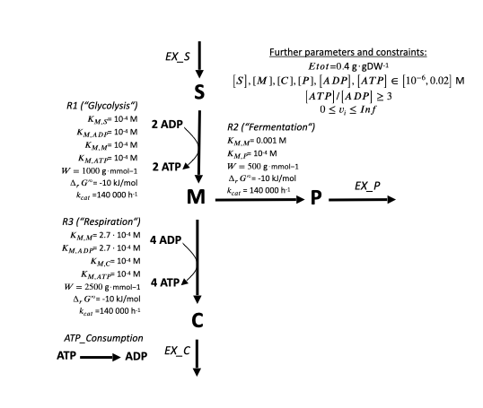

# Building metabolic models from scratch

??? abstract "Quickstart code"
    ```py
    # IMPORT SECTION
    from math import log

    from .constants import STANDARD_R, STANDARD_T
    from .dataclasses import (
        Enzyme,
        EnzymeReactionData,
        ExtraLinearConstraint,
        Metabolite,
        Model,
        Reaction,
    )

    # EXAMPLE MODEL DEFINITION SECTION
    toy_model = Model(
        reactions={
            # Metabolic reactions
            "Glycolysis": Reaction(
                # Stoichiometrically relevant member variables
                stoichiometries={
                    "S": -1,  # Negative stoichiometry → S is consumed by Glycolysis
                    "ADP": -2,
                    "M": +1,  # Positive stoichiometry → M is produced by Glycolysis
                    "ATP": +2,  # Two ATP molecules are produced by Glycolysis
                },
                min_flux=0.0,  # Minimal flux in mmol⋅gDW⁻¹⋅h⁻¹; should be ≥0 for most analyses
                max_flux=1_000.0,  # Maximal flux in mmol⋅gDW⁻¹⋅h⁻¹
                # Thermodynamically relevant member variables
                # (only neccessary if thermodynamic constraints are used)
                dG0=-10.0,  # Standard Gibb's free energy ΔG'° in kJ⋅mol⁻¹; Default is None (no ΔG'°)
                dG0_uncertainty=None,  # ΔG'° uncertainty in kJ⋅mol⁻¹; Default is None (no uncertainty)
                # Let's set the variable for enzyme-kinetic parameters
                # of the dataclass EnzymeReactionData
                # (Default is None, i.e. no enzyme parameters given)
                enzyme_reaction_data=EnzymeReactionData(
                    identifiers=[
                        "E_glyc"
                    ],  # Subunit(s) which constitute the reaction's catalyst
                    k_cat=140_000.0,  # Turnover number in h⁻¹
                    k_ms={  # Michaelis-Menten constants in M=mol⋅l⁻¹; Default is {}
                        "S": 0.0001,  # e.g., K_m of reaction Glycolysis regarding metabolite A
                        "ADP": 0.0001,
                        "M": 0.0001,
                        "ATP": 0.0001,
                    },
                    special_stoichiometries={},  # No special stoichiometry, all subunits occur once
                ),
                # Extra information member variables
                annotation={"description": "This is reaction Glycolysis"},  # Default is {}
                name="Reaction Glycolysis",  # Default is ""
            ),
            "Respiration": Reaction(
                stoichiometries={
                    "M": -1,
                    "ADP": -4,
                    "C": +1,
                    "ATP": +4,
                },
                min_flux=0.0,
                max_flux=1_000.0,
                dG0=-10.0,
                enzyme_reaction_data=EnzymeReactionData(
                    identifiers=["E_resp"],
                    k_cat=140_000.0,
                    k_ms={
                        "ADP": 0.00027,
                        "M": 0.00027,
                        "C": 0.0001,
                        "ATP": 0.0001,
                    },
                ),
            ),
            "Overflow": Reaction(
                stoichiometries={
                    "M": -1,
                    "P": +1,
                },
                min_flux=0.0,
                max_flux=1_000.0,
                dG0=-10.0,
                enzyme_reaction_data=EnzymeReactionData(
                    identifiers=["E_over"],
                    k_cat=140_000.0,
                    k_ms={
                        "M": 0.001,
                        "P": 0.0001,
                    },
                ),
            ),
            # Exchange reactions
            "EX_S": Reaction(
                stoichiometries={
                    "S": +1,
                },
                min_flux=0.0,
                max_flux=1_000.0,
            ),
            "EX_C": Reaction(
                stoichiometries={
                    "C": -1.0,
                },
                min_flux=0.0,
                max_flux=1_000.0,
            ),
            "EX_P": Reaction(
                stoichiometries={
                    "P": -1,
                },
                min_flux=0.0,
                max_flux=1_000.0,
            ),
            "ATP_Consumption": Reaction(
                stoichiometries={
                    "ATP": -1,
                    "ADP": +1,
                },
                min_flux=0.0,
                max_flux=1_000.0,
            ),
        },
        metabolites={
            "S": Metabolite(
                log_min_conc=log(
                    1e-6
                ),  # optional, minimal ln(concentration); Default is ln(1e-6 M)
                log_max_conc=log(
                    0.02
                ),  # optional, maximal ln(concentration); Default is ln(0.02 M)
                annotation={
                    "description": "This is metabolite S"
                },  # optional, default is ""
                name="Metabolite S",  # optional, default is ""
                formula="X",  # optional, default is ""
                charge=0,  # optional, default is 0
            ),
            "M": Metabolite(),
            "C": Metabolite(),
            "P": Metabolite(),
            "ATP": Metabolite(),
            "ADP": Metabolite(),
        },
        enzymes={
            "E_glyc": Enzyme(
                molecular_weight=1_000.0,  # Molecular weight in kDa
                min_conc=None,  # Optional concentration in mmol⋅gDW⁻¹; Default is None (minimum is 0)
                max_conc=None,  # Optional maximal concentration in mmol⋅gDW⁻¹; Default is None (only protein pool restricts)
                annotation={"description": "Enzyme of Glycolysis"},  # Default is {}
                name="Glycolysis enzyme",  # Default is ""
            ),
            "E_resp": Enzyme(molecular_weight=2_500.0),
            "E_over": Enzyme(molecular_weight=500.0),
        },
        max_prot_pool=0.4,  # In g⋅gDW⁻¹; This value is used for our analyses with enzyme constraints
        # We set the following two constraints:
        # 1.0 * EX_A - 1.0 * Glycolysis ≤ 0.0
        # and
        # 1.0 * EX_A + 1.0 * Glycolysis ≥ 0.0
        # in other words, effectively,
        # 1.0 * EX_A = 1.0 * Glycolysis
        extra_linear_constraints=[
            ExtraLinearConstraint(
                stoichiometries={
                    "EX_S": -1.0,
                    "Glycolysis": 1.0,
                },
                lower_value=0.0,
                upper_value=0.0,
            )
        ],  # Keep in mind that this is a list as multiple extra flux constraints are possible
        kinetic_ignored_metabolites=[],
        R=STANDARD_R,
        T=STANDARD_T,
        max_conc_sum=float("inf"),
        annotation={"description": "COBRA-k toy model"},
    )
    ```

To encode a metabolic network in COBRA-k, you can:

1. Create a model from scratch - explained in this chapter :-)
2. Load an already existing metabolic model - all such options, including JSON & SBML import/export, are explained in the next chapters :D

Here, we recreate the toymodel from COBRA-k's publication [](). It looks as follows:



Arrows stand for toy *reactions* with the name given in italic letters. Bold letters for toy *metabolites*. The numbers at the begin and end of arrows stand for the stoichiometry of each metabolite. E.g. the toy reaction "Respiration" looks as follows:
```
1 M ⇒ 1 C + 6 ATP
```

By convention, reactions starting with "EX_" are substrate or product exchange reactions. They produce/consume their metabolite out of/into nothing, simulating an exchange with the outside. Such "EX" reactions are neccessary to make constraint-based model calculations work (see next chapters).

The reactions "Glycolysis", "Respiration" and "Overflow" are toy metabolic reactions with a full set of kinetic and thermodynamic parameters.

!!! note
    The usage of stoichiometric, kinetic and thermodynamic parameters will be explained in the following chapters. Here, we concentrate on recreating the model first and simply set the parameters as neccessary.

## Model

Programmatically, a metabolic model in COBRA-k is an instance of the [dataclass](https://docs.python.org/3/library/dataclasses.html) Model.

!!! info "About dataclasses and pydantic validation"
    Dataclasses hold multiple objects together as one dataclass object. In many programming languages, they are known as ```struct```. The objects held by a dataclass are called *member variables*.

    To automatically validate that your data is in the right numeric ranges (e.g., we only want positive values for molecular weights of enzymes), COBRA-k also integrated pydantic [[GitHub]](https://github.com/pydantic/pydantic) validation for its dataclasses. That's why you can find pydantic types such as ```PositiveFloat```in COBRA-k's dataclass definitions. But you can still use normal types (e.g. ```float```instead of ```PositiveFloat```) for any dataclass member variable.

As a first step, we'll create a Model dataclass instance with an empty set of metabolites, reactions and enzymes (we'll fill these sets later on) and where we explicitly set every member variable for didactic purposes:

```py
# All COBRA-k dataclasses can be found in the "dataclasses" submodule
from cobrak.dataclasses import Model
# In the "constants" subpackage, we can find values and identifiers
# that are used throughout COBRA-k
from cobrak.constants import STANDARD_R, STANDARD_T

# Instantiate empty Model
toy_model = Model(
    metabolites={}, # will become a dict[str, Metabolite] (see below)
    reactions={}, # will become a dict[str, Reaction] (see below)
    enzymes={}, # optional, default is {}, will become a dict[str, Enzyme] (see below)
    max_prot_pool=0.4, # optional, default is 1e9
    extra_linear_constraints=[], # optional, defaults to []
    kinetic_ignored_metabolites=[], # optional, defaults to []
    R=STANDARD_R, # optional, defaults to STANDARD_R = 8.314e-3 kJ⋅K⁻¹⋅mol⁻¹
    T=STANDARD_T, # optional, defaults to STANDARD_T = 298.15 K = 25 °C = 77 °F
    max_conc_sum=float("inf"), # optional, defaults to float("inf")
    annotation={"description": "COBRA-k toy model"}, # optional, defaults to {}
    # For additional Model member variables not relevant here, see below :-)
)
```

Only ```metabolites``` and ```reactions``` are neccessary and we'll fill them in the following paragraphs :-) All other member variables are only neccessary if you want to use COBRA-k's kinetic and/or thermodynamic analysis features, which are explained in the next chapters.

The Model member variables have the following meaning (variables in italic are *optional*):

* metabolites: dict[str, Metabolite] ~ This dictionary contains the metabolite names as *keys*, and metabolite data instances as *values*. Further explained below.
* reactions: dict[str, Reaction] ~ This dictionary contains the reaction names as *keys*, and reaction data instances as *values*. Further explained below.
* *max_prot_pool: float* ~ Only relevant if enzymatic constraints are used (see the "Linear Programs" chapter). It represents the fraction of the modeled enzymes on the total biomass. The unit is g/gDW.
* *extra_linear_constraints: list[ExtraLinearConstraint]* ~ Stands for linear set relationships between model variables. Further explained below.
* *kinetic_ignored_metabolites*: list[str] ~ Only relevant if enzyme kinetic constraints are used (see "Non-linear Programs" chapter). Contains the metabolite identifiers (see next paragraph) of metabolites which do not need a $K_M$ value (see chapter about NLPs for more).
* *R: float* ~ Only relevant if thermodynamic constraints are used (see the "Mixed-Integer Linear Programs" chapter). Stands for the gas constant in kJ/(K⋅mol).
* *T: float* ~ Only relevant if thermodynamic constraints are used (see the "Mixed-Integer Linear Programs" chapter). Stands for the temperature in K.
* *T: float* ~ Only relevant if thermodynamic constraints are used (see the "Mixed-Integer Linear Programs" chapter). Stands for the temperature in K.
* *max_conc_sum: float* ~ Only relevant if thermodynamic constraints are used (see "Mixed-Integer Linear Programs" chapter). Stands for the maximally allowed sum of concentrations in a solutions. If it is set to ```float("inf")``` (which is also the default value), no such constraint is introduced. Note that in mixed-integer linear programs, an approximation is used (as explained in the "Mixed-Integer Linear Programs" chapter) which can be further controlled by the ```conc_sum_...``` member variables explained below. Also note the member variable ```conc_sum_include_suffixes``` as only metabolites with the given suffixes in their IDs are included in the concentration sum.

??? info "Further optional Model member variables"
    There are also further optional Model member variables that may be used (but are not relevant for our toy model):

    * *fwd_suffix: str* ~ Only relevant if statistics of forward and reverse reaction directions are regarded, or such reactions shall be merged in an SBML export (see 'Load/Save Models' chapter). This is a suffix (i.e. something attached to the end) for all of the Model's forward reaction IDs. E.g. if we would have a reversible reaction A→B, its forward direction would be indicated by this suffix. Note that you have to add this suffix manually to all of your forward direction reactions! Default is ```'_FWD'```.
    * *rev_suffix: str* ~ Only relevant if statistics of forward and reverse reaction directions are regarded, or such reactions shall be merged in an SBML export (see 'Load/Save Models' chapter). This is a suffix for all of the Model's reverse reaction IDs. E.g. if we would have a reversible reaction A→B, its reverse direction B→A would be indicated by this suffix. Note that you have to add this suffix manually to all of your reverse direction reactions! Default is ```'_REV'```.
    * *conc_sum_ignore_prefixes: list[str]* ~ Only relevant if ```max_conc_sum != float("inf")``` (see above) and mixed-integer linear programs with thermodynamic constraints are used (see "Mixed-Integer Linear Programs" chapter). Metabolites with the given prefixes are *not* included in the concentration sum constraint (see next member variable). Default is ```[]```.
    * *conc_sum_include_suffixes: list[str]* ~ Only relevant if ```max_conc_sum != float("inf")``` (see above) and mixed-integer linear programs with thermodynamic constraints are used (see "Mixed-Integer Linear Programs" chapter). Only metabolites with the given suffixes are included in the concentration sum constraint. Default is ```[]```.
    * *conc_sum_max_rel_error: float* ~ Only relevant if ```max_conc_sum != float("inf")``` (see above) and mixed-integer linear programs with thermodynamic constraints are used (see "Mixed-Integer Linear Programs" chapter). Stands for the maximal allowed relative concentration sum approximation error. Default is ```0.05```, i.e. 5 %.
    * *conc_sum_min_abs_error: float* ~ Only relevant if ```max_conc_sum != float("inf")``` (see above) and mixed-integer linear programs with thermodynamic constraints are used (see "Mixed-Integer Linear Programs" chapter). Stands for the minimal absolute value of an approximated concentration sum. Default is ```1e-6```.

## Metabolite

Now, let's create the metabolites $S$, $M$, $C$, $P$ and $ATP$ for our toy model. For this, we use COBRA-k's Metabolite dataclass, and use it in our Model instance:

```py
# Import COBRA-k's Metabolite dataclass
from cobrak.dataclasses import Metabolite
# Let's import the standard Python natural logarithm function
from math import log

toy_model.metabolites = {
    "S": Metabolite(
        log_min_conc=log(1e-6), # optional, minimal ln(conc); Default is ln(1e-6 M)
        log_max_conc=log(0.02), # optional, maximal ln(conc); Default is ln(0.02 M)
        annotation={"description": "This is metabolite A"}, # optional, default is ""
        name="Metabolite A", # optional, default is ""
        formula="X", # optional, default is ""
        charge=0, # optional, default is 0
    ),
    "M": Metabolite(),
    "C": Metabolite(),
    "P": Metabolite(),
    "ATP": Metabolite(),
    "ADP": Metabolite(),
}
```

!!! note
    A metabolite's ID (the name with which it can be accessed) is set as the key of the ```metabolites``` member variable dictionary.

    Also, you don't have to set Metabolite instances all at once. E.g. alternative ways to set ATP in our model are:

    ```py
    # Alternative 1
    toy_model.metabolites["ATP"] = Metabolite()

    # Alternative 2
    atp = Metabolite()
    toy_model.metabolites["ATP"] = atp

    # Alternative 3
    atp_id = "ATP"
    atp_met = Metabolite()
    toy_model.metabolites[atp_id] = atp_met
    ```

    These alternatives also apply for Reaction and Enzyme instances (see below).


The (optional) Metabolite member variables are:

* *log_min_conc: float & log_max_conc: float* ~ only relevant if thermodynamic constraints are used (see chapter "Linear Programs"). They stand for the logarithmized minimal and maximal allowed concentration of the metabolite. The concentration's unit is M=mol/l.
* *annotation: dict[str, str]* ~ Optional extra data in the form of a dictionary.
* *name: str* ~ Optional colloquial name of metabolite.
* *charge: int* ~ Optional electron charge of metabolite. Is not used in analyses right now, but may help the user as additional information.


## Reaction

Now, we create the toy model's reactions together (if given) with their parameters:

1. Glycolysis: S + 2 ADP ⇒ M + 2 ATP
2. Respiration: M + 4 ADP ⇒ C + 4 ATP
3. Overflow: M ⇒ P
4. EX_S: ⇒ S
5. EX_C: C ⇒
6. EX_P: P ⇒
7. ATP_Consumption: ATP ⇒ ADP

This can be done using COBRA-k's Reaction and EnzymeReactionData dataclasses and setting our toy model Model instance's ```reaction``` member variable:

```py
# Let's import the relevant COBRA-k dataclasses
from cobrak.dataclasses import Reaction, EnzymeReactionData

toy_model.reactions = {
    # Metabolic reactions
    "Glycolysis": Reaction(
        # Stoichiometrically relevant member variables
        stoichiometries={
            "S": -1,  # Negative stoichiometry → S is consumed by Glycolysis
            "ADP": -2,
            "M": +1,  # Positive stoichiometry → M is produced by Glycolysis
            "ATP": +2,  # Two ATP molecules are produced by Glycolysis
        },
        min_flux=0.0,  # Minimal flux in mmol⋅gDW⁻¹⋅h⁻¹; should be ≥0 for most analyses
        max_flux=1_000.0,  # Maximal flux in mmol⋅gDW⁻¹⋅h⁻¹
        # Thermodynamically relevant member variables
        # (only neccessary if thermodynamic constraints are used)
        dG0=-10.0,  # Standard Gibb's free energy ΔG'° in kJ⋅mol⁻¹; Default is None (no ΔG'°)
        dG0_uncertainty=None,  # ΔG'° uncertainty in kJ⋅mol⁻¹; Default is None (no uncertainty)
        # Let's set the variable for enzyme-kinetic parameters
        # of the dataclass EnzymeReactionData
        # (Default is None, i.e. no enzyme parameters given)
        enzyme_reaction_data=EnzymeReactionData(
            identifiers=[
                "E_glyc"
            ],  # Subunit(s) which constitute the reaction's catalyst
            k_cat=140_000.0,  # Turnover number in h⁻¹
            k_ms={  # Michaelis-Menten constants in M=mol⋅l⁻¹; Default is {}
                "S": 0.0001,  # e.g., K_m of reaction Glycolysis regarding metabolite A
                "ADP": 0.0001,
                "M": 0.0001,
                "ATP": 0.0001,
            },
            special_stoichiometries={},  # No special stoichiometry, all subunits occur once
        ),
        # Extra information member variables
        annotation={"description": "This is reaction Glycolysis"},  # Default is {}
        name="Reaction Glycolysis",  # Default is ""
    ),
    "Respiration": Reaction(
        stoichiometries={
            "M": -1,
            "ADP": -4,
            "C": +1,
            "ATP": +4,
        },
        min_flux=0.0,
        max_flux=1_000.0,
        dG0=-10.0,
        enzyme_reaction_data=EnzymeReactionData(
            identifiers=["E_resp"],
            k_cat=140_000.0,
            k_ms={
                "ADP": 0.00027,
                "M": 0.00027,
                "C": 0.0001,
                "ATP": 0.0001,
            },
        ),
    ),
    "Overflow": Reaction(
        stoichiometries={
            "M": -1,
            "P": +1,
        },
        min_flux=0.0,
        max_flux=1_000.0,
        dG0=-10.0,
        enzyme_reaction_data=EnzymeReactionData(
            identifiers=["E_over"],
            k_cat=140_000.0,
            k_ms={
                "M": 0.001,
                "P": 0.0001,
            },
        ),
    ),
    # Exchange reactions
    "EX_S": Reaction(
        stoichiometries={
            "S": +1,
        },
        min_flux=0.0,
        max_flux=1_000.0,
    ),
    "EX_C": Reaction(
        stoichiometries={
            "C": -1.0,
        },
        min_flux=0.0,
        max_flux=1_000.0,
    ),
    "EX_P": Reaction(
        stoichiometries={
            "P": -1,
        },
        min_flux=0.0,
        max_flux=1_000.0,
    ),
    # ATP "maintenance" reaction
    "ATP_Consumption": Reaction(
        stoichiometries={
            "ATP": -1,
            "ADP": +1,
        },
        min_flux=0.0,
        max_flux=1_000.0,
    ),
}
```

Reaction's member variables are as follows (optional variables are *italic*):

* stoichiometries: dict[str, float] ~ A dictionary that describes the stoichiometry of the reaction. Metabolite IDs are keys, stoichiometries values.
* min_flux: float ~ Minimal flux in mmol/(gDW⋅h); **For most analyses, it must be ≥0, i.e. the reaction must be irreversible (no backwards flux possible)**.
* max_flux: float ~ Maximal flux in mmol/(gDW⋅h)
* *dG0: float* ~ Only neccessary if thermodynamic constraints are used; Standard Gibbs free energy (ΔrG'°) of the reaction. For more about it, see [the great explanation from the eQuilibrator FAQ](https://equilibrator.weizmann.ac.il/static/classic_rxns/faq.html#what-are-rg-rg-and-rg).
* *dG0_uncertainty: float*: Only neccessary if thermodynamic constraints are used; The standard Gibb free energy's uncertainty, as returned, e.g., by the eQuilibrator API.
* *enzyme_reaction_data: None | EnzymeReactionData* ~ See subparagraph below.
* *annotation: dict[str, str]* ~ Any additional information regarding this reaction.
* *name: str* ~ Optional colloquial name of reaction.


!!! info
    Reaction and Metabolite are the only *obligatory* dataclasses for a Model. All following presented dataclasses are only neccessary if you want to use enzymatic, kinetic and/or thermodynamic constraints. For these, see chapters "Linear Programs" and "Non-Linear Programs", which also explain what you can do with a Model as built here ;-)

## EnzymeReactionData

The defining feature of COBRA-k is that it can include the *full* reversible Michaelis-Menten kinetics. For this, COBRA-k needs associated enzymatic and kinetic data if it is known for a reaction (in this example, we just set some arbitrary values). If such data exists, we can set a Reaction's ```enzyme_reaction_data``` member variable to an EnzymeReactionData instance. If such data does not exist, enzyme_reaction_data is just ```None```, which is also its default value.

In our toy model, we could set the ```enzyme_reaction_data``` of the three toy metabolic reactions. Thereby, the member variables ```identifiers``` and ```k_cat``` are the only obligatory member variables for an EnzymeReactionData instance and all that's needed for "classic" linear enzyme-constrained modeling (see chapter "Linear Programs"). The other member variables are neccessary for the new COBRA-k non-linear modeling methologies (see chapter "Non-Linear Programs"). The member variables are:

* identifiers: list[str] ~ List of Enzyme IDs (see next subparagraph)
* k_cat: float ~ Turnover number in h
* *k_ms: dict[str, float]* ~ Michaelis-Menten constants for metabolites; the metabolites IDs are the string keys, and the $K_M$ values the float values. Defaults to {}.
* *special_stoichiometries: dict[str, float]* ~ If any of the reaction's enzyme subunits (given in ```identifiers```) has a stoichiometry that differs from 1, it can be given here. E.g. if an enzyme $E$ would occur twice to form the reaction's enzyme complex, special_stoichiometries would be ```{"E": 2}```.

!!! note
    In COBRA-k, we assume that there is *only one* enzyme (complex) that catalyzes a single reaction. If multiple enzymes can catalyze the stoichiometrically identical reaction, multiple reactions have to be created in a Model. Nevertheless, this single enzyme that catalyzes a reaction
    can be made out of multiple subunits, all which are referenced in the ```identifiers```
    member variable of EnzymeReactionData.

??? info "Adding references for $k_cat$ and $k_M$ data in EnzymeReactionData"
    EnzymeReactionData also provides the following two optional member variables:

    * *k_cat_references: list[ParameterReference]* and
    * *k_m_references: list[ParameterReference]*

    Both use ```cobrak.dataclasses.ParameterReference```, which you can look up in this documentation's API overview.
    Using parameter references, you can e.g. include from which database(s) or paper(s) you got your information regarding
    the $k_{cat}$ or $k_M$.

## Enzyme

Any enzyme (or enzyme subunit) that is referenced in the identifiers of a reaction's EnzymeReactionData instance must be included as its own Enzyme instance, as part of the Model's enzyme variable. In our toy_model, we may add the enzymes as follows:

```py
from cobrak.dataclasses import Enzyme

toy_model.enzymes={
    "E_glyc": Enzyme(
        molecular_weight=1_000.0, # Molecular weight in kDa
        min_conc=None, # Optional concentration in mmol⋅gDW⁻¹; Default is None (minimum is 0)
        max_conc=None, # Optional maximal concentration in mmol⋅gDW⁻¹; Default is None (only protein pool restricts)
        annotation={"description": "Enzyme of Glycolysis"}, # Default is {}
        name="Glycolysis enzyme", # Default is ""
    ),
    "E_resp": Enzyme(molecular_weight=2_500.0),
    "E_over": Enzyme(molecular_weight=500.0),
},
```

The full molecular weight of a reaction's enzyme is the sum of all its subunit molecular weights. In this example, A_to_B's enzyme E has the weight 100.0 kDa + 110.0 kDa=210.0 kDa.

Only the molecular weight is mandatory to be set, all other member variables are optional. If ```min_conc``` and/or ```max_conc``` are ```None```, their respective concentration bounds are ignored. I.e., if ```min_conc``` is its default value ```None```, the enzyme's minimal concentration is just 0; if ```max_conc``` is ```None```, the enzyme's maximal concentration is as high as possible (```max_prot_pool / molecular_weight```).

```max_prot_pool``` ($Ω$ in our formulas) stands for the biomass fraction of all modeled metabolic enzymes. Its unit is g⋅gDW⁻¹ and it is an essential upper limit for the usage of enzymes in our analyses with enzyme constraints (see next chapters). In our toy model, we set it to 0.5 g⋅gDW⁻¹:

```py
toy_model.max_prot_pool = 0.5
```

## ExtraLinearConstraint

Optional extra linear constraints (further explained in the chapter "Linear Programs") can be included. E.g., if we want to set the (admittedly unnecessary as the model structure already enforces it in steady-state) reaction $EX_S$ to have the same flux as reaction Glycolysis, we would set

```py
from cobrak.dataclasses import ExtraLinearConstraint

# We set the following two constraints:
# 1.0 * EX_S - 1.0 * Glycolysis ≤ 0.0
# and
# 1.0 * EX_S + 1.0 * Glycolysis ≥ 0.0
# in other words, effectively,
# 1.0 * EX_S = 1.0 * Glycolysis
toy_model.extra_linear_constraints=[ExtraLinearConstraint(
    stoichiometries={
        "EX_S": -1.0,
        "Glycolysis": 1.0,
    },
    lower_value=0.0,
    upper_value=0.0,
)] # Keep in mind that this is a list as multiple extra flux constraints are possible
```

!!! note
    Extra linear constraints do not only work with reaction fluxes, but also with all other variables introduced in the analyses provided by COBRA-k (see next chapters). E.g. you could also use logarithmic metabolite concentrations, saturation values etc. inside an extra linear constraint, and even mix these types of variables.

## Loading a completed toy_model

We are going to use the toy model that we created in the next chapters. You don't have to add the code of this chapter manually to provide the model as it is already provided as a COBRA-k example model:

```py
from cobrak.example_models import toy_model

# Now, we can do what we want with this chapter's toy_model :-)
```
